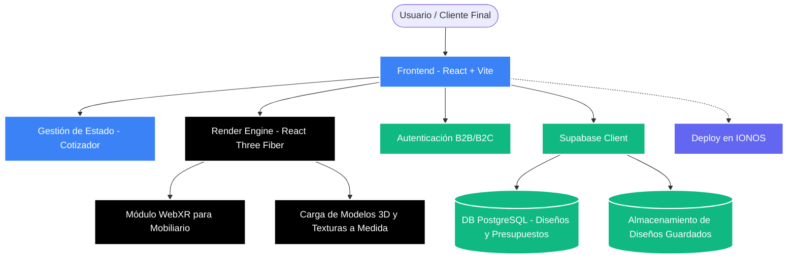

# Tavilga 3D Configurator - Diseño de Mobiliario a Medida

[](https://vitejs.dev/)
[](https://docs.pmnd.rs/react-three-fiber/)
[](https://supabase.com/)

## 📌 Resumen Ejecutivo
**Tavilga 3D** es un avanzado software de **diseño de mobiliario 3D a medida** basado en tecnologías web inmersivas (WebXR y WebGL). Diseñado para permitir a los usuarios visualizar, configurar e interactuar con modelos de mobiliario en tiempo real desde el navegador, calcular presupuestos dinámicos y garantizar la persistencia segura en la nube vía Supabase.

Esta solución Enterprise-Grade optimiza los tiempos de carga mediante empaquetado optimizado (Vite + Terser) y renderizado reactivo con React Three Fiber, ofreciendo una experiencia B2C y B2B fluida para el sector del interiorismo y fabricación de muebles.

---

## 🏗️ Arquitectura de la Solución (Mermaid)



---

## 📚 Estructura de Componentes

```text
Diseno3DGenerico/
├── src/                    # Lógica de aplicación React y Configurador
├── public/                 # Assets 3D estáticos, modelos de muebles y texturas
├── supabase/               # Configuraciones y migraciones de DB (Presupuestos)
├── dist/                   # Build optimizado para producción
└── DEPLOY_IONOS.md         # Guía de integración continua y despliegue
```

---

## 🔐 Seguridad y Escalabilidad
1. **Zero-Trust Client:** El cliente de Supabase implementa RLS (Row Level Security) nativo en PostgreSQL para garantizar la privacidad de los diseños y presupuestos de cada usuario.
2. **Performance:** Bundle tree-shaking optimizado con Vite, manteniendo el tamaño gzipped por debajo de los 700 KB para tiempos de Time-To-Interactive (TTI) ultra rápidos, crucial para la retención en e-commerce de mobiliario.
